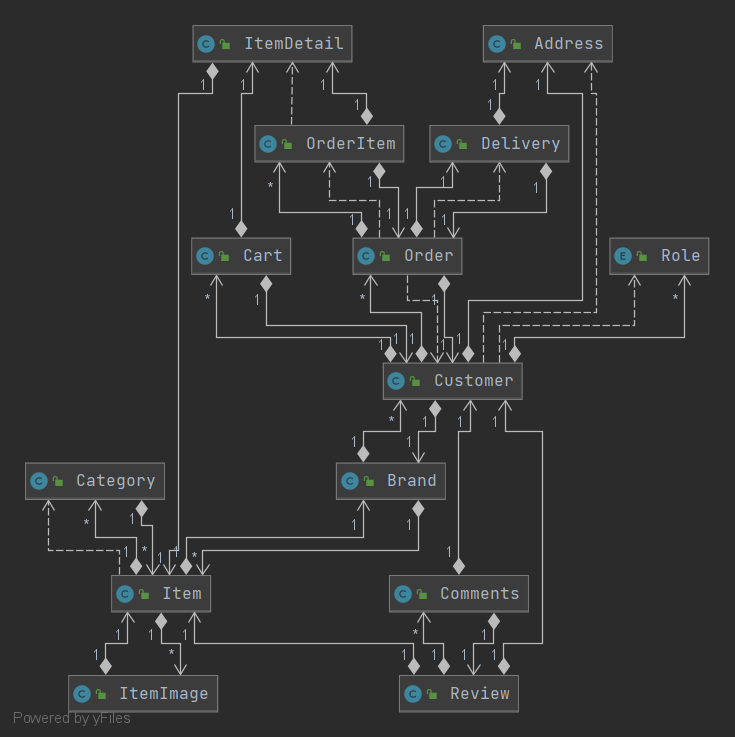

# 패션이커머스 프로젝트(Ourstandard) with SpringBoot + JPA + Thymleaf

해당 프로젝트는 기존 Spring framework+jsp+Mybatis 기반의 팀프로젝트를 **SpringBoot, JPA, Thymleaf** 기반으로 변형한 단독 프로젝트 입니다.

> 기존 팀 프로젝트 보러가기 Click >> [Ourstandard](https://github.com/damlee89/standard-project)

___
## 리펙토링 포인트
1. JPA을 활용한 도메인주도 설계의 실습
2. SpringBoot와 Thymleaf의 활용
3. 보안 설정 개선 및 페이징 구현
4. 기존 팀프로젝트 시에 해보지 못했던 부분까지 직접 구현

___
## 적용 기술

**SpringBoot, JPA,SpringSecurity , Thymleaf, HTML, CSS, JavaScript, Ajax, jQuery**

___
## 요구 사항 목록

|구 분|상 세|Requirements|
|:--:|:--:|:--|
|고객|스토어|**1.** 상품은 카테고리 별로 조회 가능하며 페이지별 조회가능 **2.** 상품 검색은 상품명, 브랜드명으로 검색 가능 **3.** 상품 조회시 옵션 선택 및 리뷰 조회 가능 **4.** 상품 조회페이지에서 옵션 선택 후 장바구니로 이동
||장바구니|**1.** 장바구니에 담긴 상품을 모아볼 수 있으며, 수량 조절 및 다중 선택 가능|
||주문폼|**1.** 장바구니에서 넘어온 상품 정보를 표시 **2.** 새로운 배송지 정보 입력 가능|
||주문 목록|**1.** 주문한 목록 확인 및 배송상태를 확인 할 수 있다. **2.** 배송 시작 전 주문 취소 가능 **3.** 리뷰작성 가능 |
||계정 찾기| 가입시 등록한 이메일과 이름을 통해 아이디 찾기 & 비밀번호 찾기를 할 수 있다. 결과는 이메일로 전송되며 비밀번호는 임시비밀번호를 전달한다.  |
||마이 페이지| 회원 정보를 수정하거나 탈퇴할 수 있다.|
|판매자|상품 관리|**1.** 카테고리 선택후 상품 이미지와 함께 상품을 등록한다 **2.** 색상,사이즈별 옵션을 추가한다. **3.** 추가한 옵션에 대한 재고 관리|
||구매 관리|**1.**고객이 주문한 목록& 배송지 조회 가능 **2.**주문 정보 클릭시 주문 아이템 목록 조회 가능 **3.**배송상태 변경 가능 |
||리뷰 조회|자사 상품에 대한 상품 리뷰 조회 가능|
|어드민|판매자 관리|가입 신청한 판매자에 대한 권한 부여 혹은 탈퇴 처리 가능|

### 비기능 요구사항
* 시프링 시큐리티를 활용한 인증& 인가 처리
* 모든 엔티티에는 최초 작성자 시간 수정자 수정시간을 확인할 수 있도록 한다.

___

## 도메인 모델

